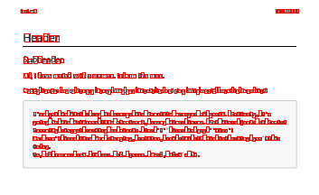

# docnet


[](https://www.nuget.org/packages/Docnet.Core)

## Description

**docnet** aims to be a fast PDF editing and data extraction library. It is a `.NET Standard 2.0` wrapper for `PDFium C++` library that is used by `chromium`.

PDFium version: `5010`

Supported platforms:

- win
- linux
- osx

## Features

- [x] Extract **PDF** version
- [x] Extract page count
- [x] Extract page information
   - [x] Get page width
   - [x] Get page height
   - [x] Get page text
   - [x] Get characters
   - [x] Get character boundaries
   - [x] Get character font sizes
   - [x] Get character angle
   - [x] Render page to image
- [x] Split **PDF** document
- [x] Merge **PDF** document
- [x] Unlock **PDF** document
- [x] Convert **JPEG** files to **PDF**

## Examples

* Render PDF page as PNG and display all character bounding boxes: [example](examples/nuget-usage/NugetUsageAnyCpu/PdfToImageExamples.cs)

   

    **Note:** If you have issues running on Linux make sure that `libgdiplus` is installed since this example uses `System.Drawing.Common`.

* Convert JPEG file to PDF: [example](examples/nuget-usage/NugetUsageAnyCpu/ImageToPdfExamples.cs)

## Usage

* DocLib.Instance should be treated as a singleton that lives as long as your application. It should only be disposed when you intend to clean all unmanaged resources of PDFium.

## .NET Framework Support

Newer versions of .NET Framework are also supported, `Docnet.Core.targets` tries to automatically find which version of the native `PDFium` binary to copy but that can sometime be unreliable especially if running on AnyCPU. You can manually specify `DocnetRuntime` property in your project file to influence which library version to copy. Allowed values are `win-x64`, `win-x86`, `linux` and `osx`.

Example below makes sure that we always copy x64 binary on windows:

```
  <PropertyGroup>
    <DocnetRuntime Condition=" '$([MSBuild]::IsOsPlatform(Windows))' ">win-x64</DocnetRuntime>
  </PropertyGroup>
```